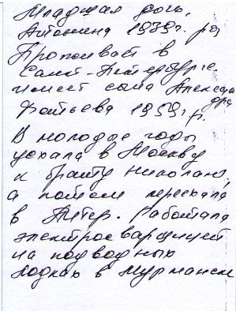

+++
date = '2025-08-25T02:21:58+07:00'
draft = false
title = 'Фотьева Антонина Сергеевна'
tags = ['Фотьева Антонина Сергеевна']
+++

# Фотьева Антонина Сергеевна

Младшая дочь (Каратаева С.Ф.), Фотьева (Мартусявичене) Антонина Сергеевна. 1939 г.р., проживает в Санкт-Петербурге, имеет сына Алесандра Фотьева (1959 г.р.). В молодые годы уехала в Москву к брату Николаю, а потом переехала в Питер. Работала электросварщицей на подводных лодках в Мурманске.

