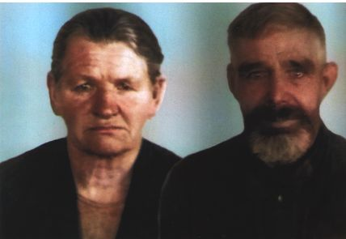
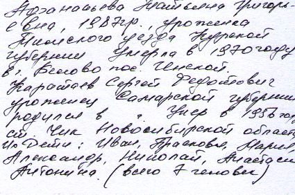

+++
date = '2025-08-25T02:33:20+07:00'
draft = false
title = 'Каратаев Сергей Федотович'
tags = ['Каратаев Сергей Федотович']
+++
# Каратаев Сергей Федотович
Прадед (Отец Малетиной Марии Сергеевны), Каратаев Сергей Федотович.

Афанасьева Татьяна Григорьевна, 1887 г.р., уроженка ... уезда Курской губернии, умерла в 1970 году в г. Белово, пос. Инской. 

Каратаев Сергей Федорович, уроженец Самарской губернии, родился в .... г. Умер в 1956 году, ст. Чик Новосибирской области.

Их дети:  Иван, Прасковья, Мария (Малетина Мария Сергеевна), Александр, Николай, Анастасия, Антонина. Всего 7 детей.

