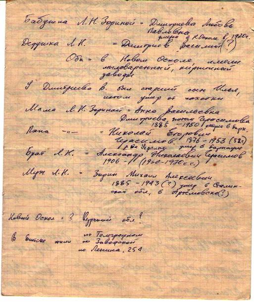
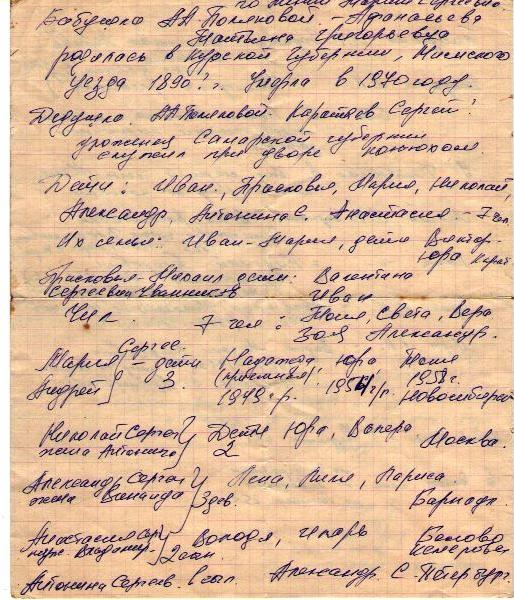
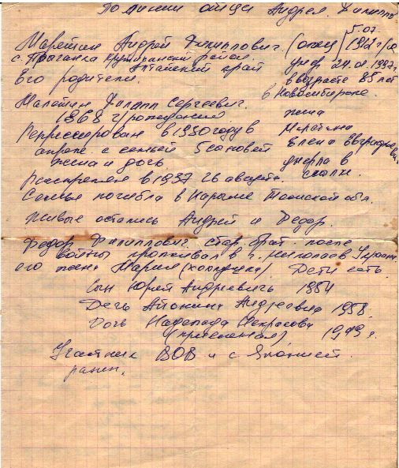

+++
date = '2025-08-25T02:44:46+07:00'
draft = false
title = 'Родословная'
+++

# Родословная
Написана моей мамой, Поляковой Антониной Андреевной.

## По линии мужа, Полякова Станислава Николаевича

Бабушка Лидии Николаевны Зориной - Дмитриева Любовь Павловна, умерла в Старом Осколе в 1920-ые.

Дедушка Л. Н. Зориной - Дмитриев Василий (?).

Оба в Новом Осколе имели мыловаренный, кирпичный заводы.

У Дмитриева В. был старший сын Илья, потом умер от чахотки.

Мама Л. Н. Зориной - Анна Васильевна Дмитриева, потом Герасимова. 1885 - 1950. (умерла в Барнауле?)

Папа - Николай Егорович Герасимов, 1876-1953(52?) ... умер в Барнауле.

Муж Л.Н. - Зорин Михаил Алексеевич, 1885-1943(?) умер в Сталинской обл (??) в Артемовске (?) 

Новый Оскол - в Курской обл ? 

В Бийске жили на телеграфной, на заводской, на Ленина 254 (или 25А).

## По линии ее мамы, Малетиной Марии Сергеевны

Бабушка А. А. Поляковой - Афанасьева Татьяна Григорьевна, родилась в Курской губернии, ... уезда в 1890(?) году. Умерла в 1970 году.

Дедушка А. А. Поляковой - Каратаев Сергей, уроженец Самарской губернии, служил при дворе конюхом.

Дети: Иван, Прасковья, Мария, Николай, Александр, Антонина, Анастасия - 7 человек.

### Семьи их детей

Их семьи: Иван+Мария, дети:  Виктор, Юра (каратаевы?)

Прасковья+Михаил, дети Валентина Сергеевна Чванникова, дети: 7 чел: Тоня, Света, Вера, Зоя, Александр.

Мария Сергеевна Малетина + Малетин Андрей Филиппович, дети (3): Надежда (приемная), 1949г.р., Юра (1954) жил в Барнауле, сейчас Красноярске, Тоня (Малетина/Полякова Антонина Андреевна), 1958. Жила в Барнауле, Кемерове, новосибирске.

Николай Сергеевич + жена Антонина(?): Дети (2) Юра, Валера (Москва)

Алексадр Сергеевич + жена Зинаида. Дети, (3 девочки) Лена, Лиля, Лариса (Барнаул)

Анастасия Сергеевна + муж Владимир. Володя, Игорь (Белово, Кемерово)

Антонина Сергеевна: 1 сын, Александр (Санкт-Петербург)

## По линии отца, Андрея Филипповича

Малетин Андрей Филиппович, отец. 05.07.1912 с. Прыганка, Крутихинский р-н Алтайский край. Умер 24.01.1997 (или 02?) в Возрасте 85 лет в г. Новосибирск.

его отец, Малетин Филипп Сергеевич, 1868 г.р. (не сходится с книгой памяти), репрессирован в 1930 году в [...] с семьей, 5 сыновей, жена и дочь. Жена Малетина Елена Евграфовна(??), умерла в ссылке. Расстелян в 1937, 26 августа.

### Малетин Филипп Сергеевич

Родился в 1865 г., Томская губ.; русский; единоличник. Проживал: Каменский р-н, с. Прыганка.
Арестован 29 июля 1937 г.
Приговорен: тройка при УНКВД по Запсибкраю 20 августа 1937 г., обв.: по ст. 58-10.
Приговор: ВМН. Расстрелян 27 августа 1937 г. Реабилитирован 25 мая 1989 г. прокуратурой АК

Источник: Книга памяти Алтайского края
https://lists.memo.ru/d21/f255.htm

Семья погибла в Нарыме Томской области. Живые остались Андрей и Федор. Федор Филиппович после войны проживал в г. Николаев, Украина. Его жена Мария (хохлушка). Дети есть. 

Дети (Андрея Филипповича Малетина и Марии Сергеевны Малетиной/Каратаевой):
- Юрий Андреевич (1954)
- Антонина Андреевна (1958)
- Надежда Некрасова(?) (приемная) (1949).

Участник ВОВ и с Японией. Ранен.

